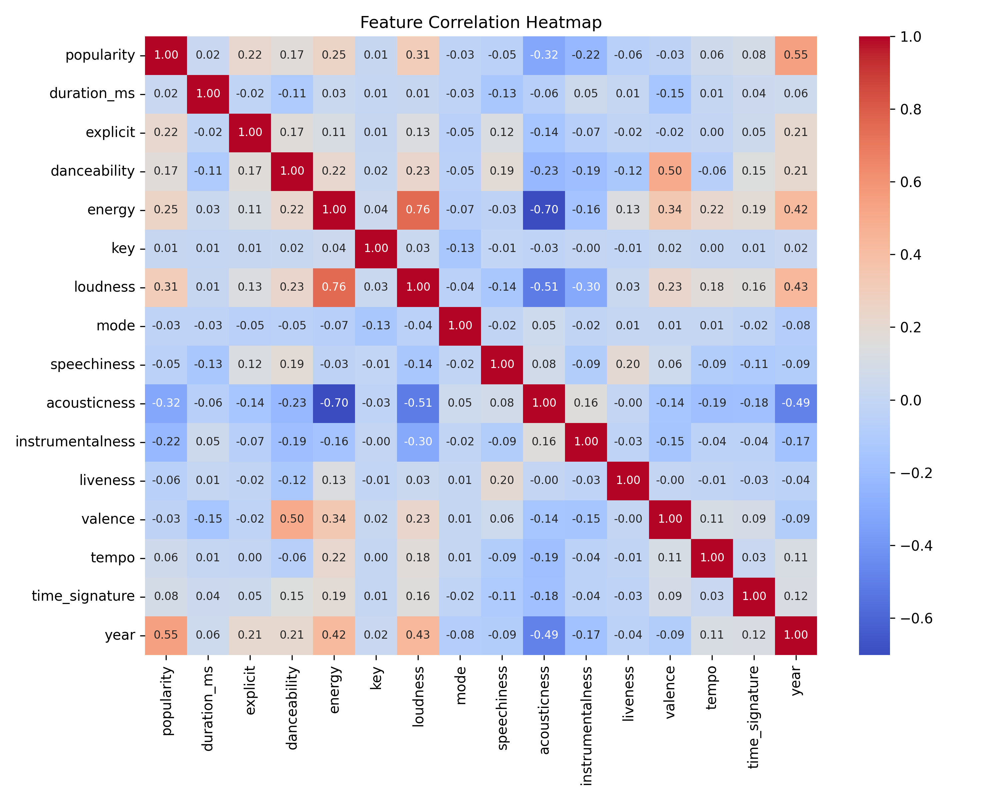
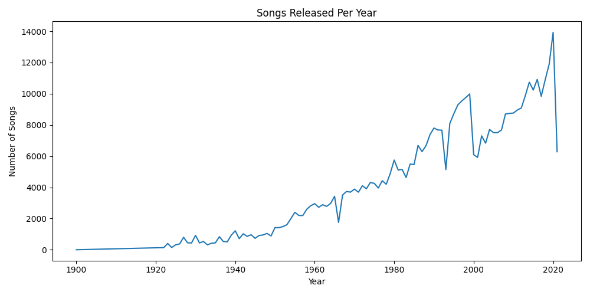
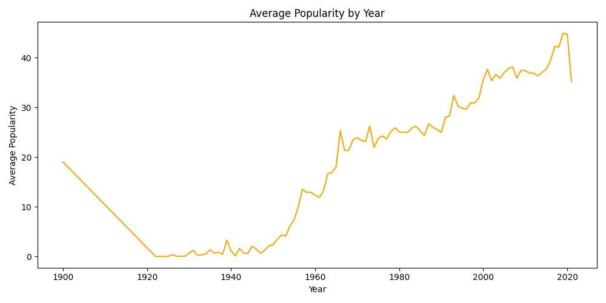
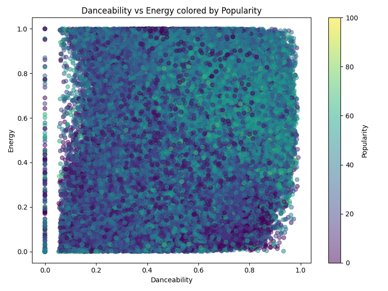

# Spotify Tracks Analysis

## 📌 Overview
This project analyzes over **580,000 Spotify tracks** to uncover patterns in popularity, release trends, and audio features.  
It uses **Python**, **Pandas**, **Matplotlib**, and **Seaborn** for data cleaning, exploration, and visualization.

## 📂 Dataset
- **Source:** [Kaggle - Spotify Tracks Dataset](https://www.kaggle.com/datasets/maharshipandya/-spotify-tracks-dataset)
- **Size:** ~586,000 rows, 21 columns
- **Key Columns:** 
  - `name`, `artists`, `release_date`, `popularity`
  - Audio features: `danceability`, `energy`, `loudness`, `acousticness`, `instrumentalness`, etc.

## 🔍 Key Findings
- **Newer songs** are generally more popular (**correlation with year: 0.54**).
- Higher **loudness** (+0.33) and **energy** (+0.30) are linked to higher popularity.
- Higher **acousticness** (–0.37) and **instrumentalness** (–0.24) are linked to lower popularity.
- Loudness and energy have a strong positive correlation (~0.74).
- The number of songs released each year has grown significantly in recent decades.

## 📊 Visuals
### Correlation Heatmap (Annotated)
Shows the relationship between numerical features:


### Songs Released Per Year


### Average Popularity by Year


### Danceability vs Energy


## 🛠 How to Run
1. Clone the repository:
   ```bash
   git clone https://github.com/<your-username>/Spotify-Analysis.git
   cd Spotify-Analysis
